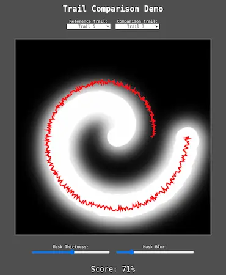

# Trail Comparison Scoring

This repo contains a simple example of an image-based method for comparing trails to a reference trail (or set of reference trails) in order to determine a 'similarity' score. The code for the comparison method is fully contained within the included [.js file](https://github.com/EricPacefactory/trail-comparison-demo/blob/main/trail_comparison.js), and a [demo](https://github.com/EricPacefactory/trail-comparison-demo/blob/main/trail_comparison_demo.html) (which uses the .js file) is included to help visualize the results.


<p align="center">
  
</p>

The idea is to first draw a mask for the given reference trail. Then for any other trail, the trail coordinates are mapped into pixel coordinates on the mask, and the pixel values of the underlying mask are read off. Where the comparison trail lands on top of the masked shape (i.e. close to the reference trail), it will read off 'high' pixel values while parts of the trail that land outside of the masked shape will get 'low' values. The final score is proportional to the average pixel value for the entire comparison trail. The highest possible score, which indicates a complete match with the reference trail, will occur if the comparison trail *always* lands on 'high' pixels.

The thickness of the line used to drawn the mask (as well as a blur) can be adjusted in order to relax the required tightness of the fit between the reference and comparison trails. The included demo file can be used to visualize the masking/comparison, where the reference mask is drawn as a black & white background image and the comparison trail is drawn as a red overlay, with the corresponding score given at the bottom.

### Running the demo

The demo file is just a basic [.html](https://github.com/EricPacefactory/trail-comparison-demo/blob/main/trail_comparison_demo.html) file. Opening this file in a browser should be all that is needed to view the demo (assuming the associated [.js](https://github.com/EricPacefactory/trail-comparison-demo/blob/main/trail_comparison.js) file is located alongside the .html file). If this fails for some reason, the file may need to be launched with a server, like the [live server extension](https://marketplace.visualstudio.com/items?itemName=ritwickdey.LiveServer) for VS Code.

### Basic Usage

All of the trail comparison functionality is stored in the .js file, specifically the `TrailComparisonMask` class contained in the file. The basic usage of the class is to first instantiate a mask using a reference trail and then to use this mask for comparisons to other trails (using the `.compare(...)` method), for example:

```javascript
// Mask settings
const width = 512;
const height = 512;
const thickness = 64;
const blur = 32;

// Make mask object from reference trail
const ref_trail = [[0.1, 0.1], [0.2, 0.2], [0.3, 0.3], [0.4, 0.4], etc...]
const mask = new TrailComparisonMask(ref_trail, width, height, thickness, blur);
      
// Compare some other trails to the mask
const trail_a = [[0.1, 0.8], [0.2, 0.3], [0.5, 0.4], [0.7, 0.1], etc...]
const trail_b = [[0.5, 0.4], [0.2, 0.2], etc...]
const trail_c = [[0.6, 0.8], [0.3, 0.7], [0.1, 0.3], etc...]
const score_a = mask.compare(trail_a);
const score_b = mask.compare(trail_b);
const score_c = mask.compare(trail_c);
console.log(score_a, score_b, score_c);  // -> 0.7, 0.4, 0.2
```

Multiple trails can be provided when creating the mask, as well as when comparing trails. In this case they should be provided as a list of trails:
```javascript
// Example using multiple trails as input for comparison
const segment_a = [[0.1, 0.8], [0.2, 0.3], [0.5, 0.4], [0.7, 0.1], etc...]
const segment_b = [[0.5, 0.4], [0.2, 0.2], etc...]
const segment_c = [[0.6, 0.8], [0.3, 0.7], [0.1, 0.3], etc...]
const score = mask.compare([segment_a, segment_b, segment_c]);
console.log(score);  // -> 0.5
```
Note however that when using multiple trails like this, they are treated as if they are broken segments of a single trail, so only 1 score will be returned. Likewise, when creating a mask out of multiple reference trails, only a single mask will be created and will be drawn as if it is the union of the trails.

### Anomaly Detection

The scoring implementation is very closely related to the [Anomaly Detection](https://github.com/EricPacefactory/anomaly-detection) repo, which has additional information that might be of some use. The main differences being that the score is inverted (e.g. similarity_score = 1 - anomaly_score) and the mask or 'heatmap' is generated as if there is only a single trail provided (even if multiple reference trails are given), as opposed to the additive build-up approach used to construct heatmaps.

### Improvements


The current implementation only accounts for positional similarity, but the method could likely be extended to account for other properties (notably directionality and maybe speed, for example) by storing data in the remaining green/blue/alpha channels of the mask!

Additionally, the way blurring is handled is not ideal, particularly the brightness of the blurring (it is too dark by default). There's probably some way to improve this, but it's a low priority.
